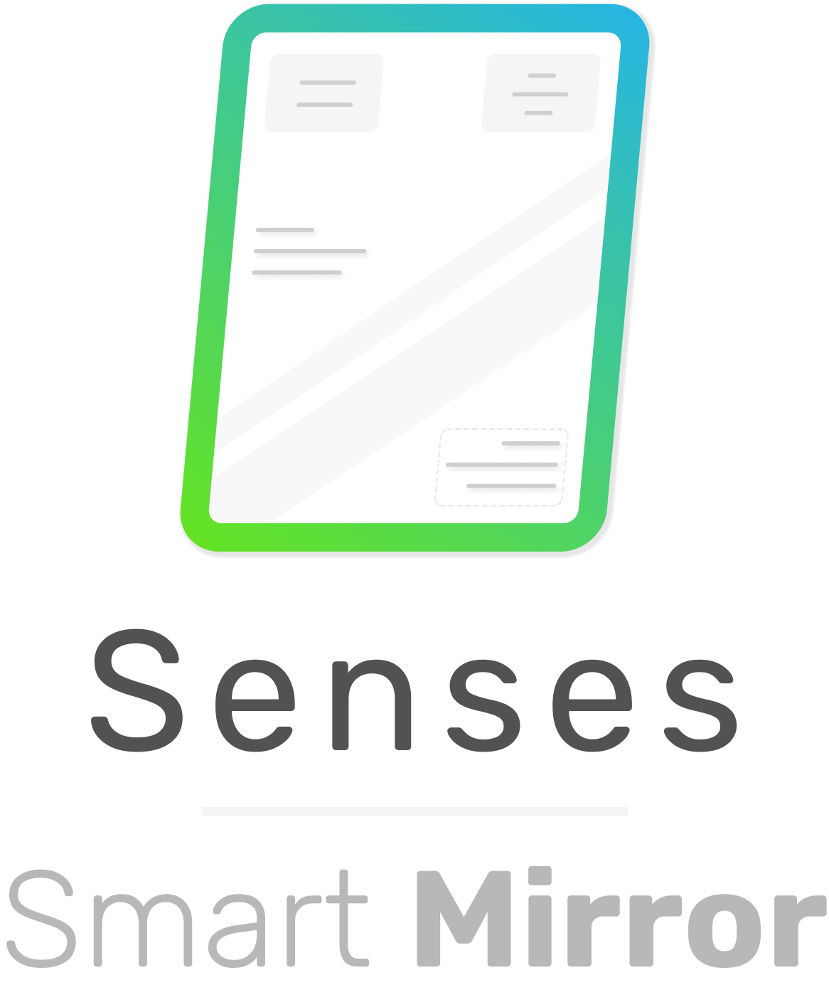
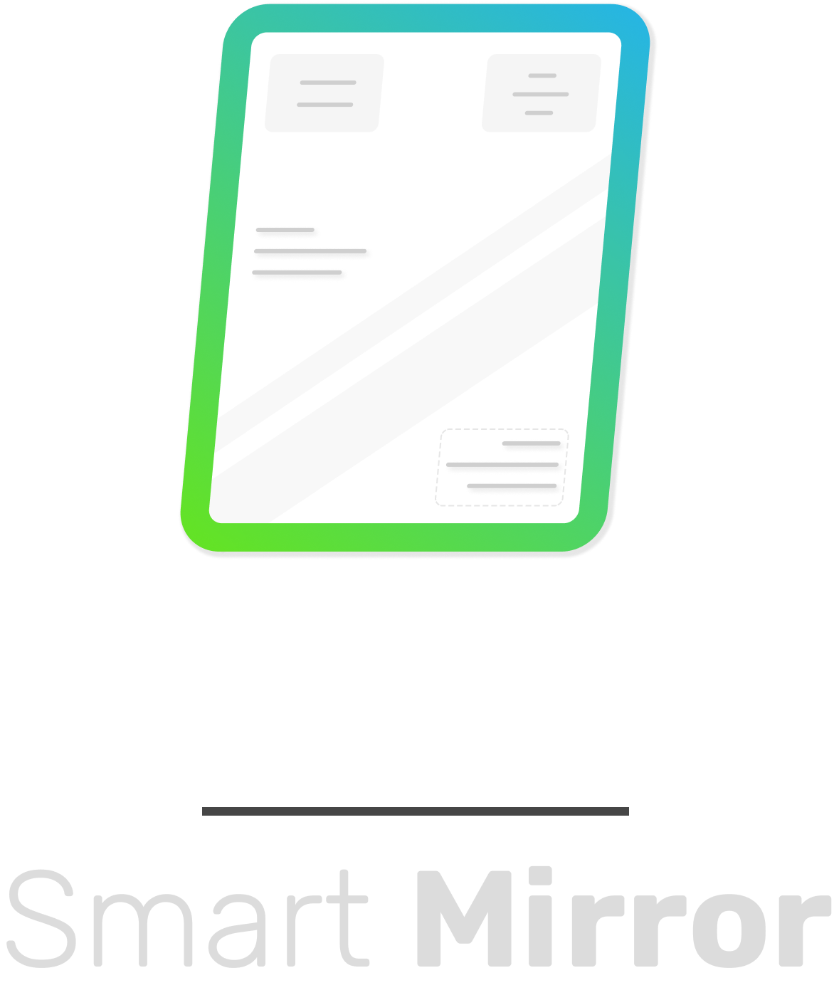

  
  

   

# Senses - Widgets
This repository contains Senses - Smart Mirror example widgets. Please see the [documentation]() on how to use (import) these widgets to your Smart Mirror.

## 1. Hello World
This widgets only displays "Hello World". You can use this widget as an example for your own widget development.

## 2. Chuck Norris
The Chuck Norris widgets show random quotes from Chuck Norris based on an interval. 